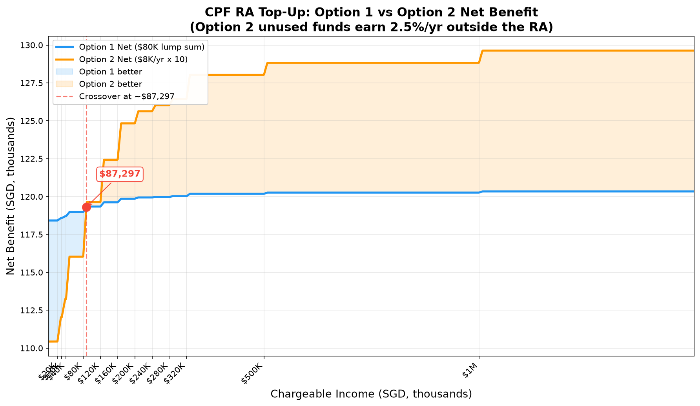

# CPF RA Cash Top-Up: Option 1 vs Option 2 Comparison

*Generated: 2026-09-28 16:03:03*

## 1. Assumptions

| # | Assumption | Details |
|---|-----------|---------|
| 1 | CPF RA interest rate | 4% p.a., compounded at year-end |
| 2 | Outside interest rate (Option 2) | 2.5% p.a. on unused funds (remaining pot) |
| 3 | Tax relief cap | $8,000 per year of assessment (YA) for self top-up |
| 4 | CPF RA cap | FRS = $220,400; ERS = $440,800 (deposits assumed within remaining cap room) |
| 5 | Carry-forward | Unused relief CANNOT be carried forward |
| 6 | Discounting | No discounting applied (nominal comparison) |
| 7 | Chargeable income | Constant across all 10 years |
| 8 | Starting age | 55 years old |

## 2. Data Sources

| Source | URL |
|--------|-----|
| IRAS Individual Income Tax Rates | https://www.iras.gov.sg/taxes/individual-income-tax/basics-of-individual-income-tax/tax-residency-and-tax-rates/individual-income-tax-rates |
| IRAS CPF Cash Top-up Relief | https://www.iras.gov.sg/taxes/individuals/resident-individuals/rates-and-reliefs/cash-top-up-relief |
| CPF RA Full Retirement Sum | https://www.cpf.gov.sg/education/cpf-101/how-much-i-need-for-retirement/retirement-adequacy/full-retirement-sum |

## 3. Singapore Progressive Income Tax Brackets (YA 2024 onwards)

| Income Band (SGD) | Rate |
|-------------------|------|
| $0 – $20,000 | 0.0% |
| $20,000 – $30,000 | 2.0% |
| $30,000 – $40,000 | 3.5% |
| $40,000 – $80,000 | 7.0% |
| $80,000 – $120,000 | 11.5% |
| $120,000 – $160,000 | 15.0% |
| $160,000 – $200,000 | 18.0% |
| $200,000 – $240,000 | 19.0% |
| $240,000 – $280,000 | 19.5% |
| $280,000 – $320,000 | 20.0% |
| $320,000 – $500,000 | 22.0% |
| $500,000 – $1,000,000 | 23.0% |
| $1,000,000 and above | 24.0% |

## 4. Year-by-Year Balance Comparison

### Option 1: $80,000 Lump Sum (Year 1)

| Year | Age | Deposit | Interest (4%) | Closing Balance |
|------|-----|---------|---------------|----------------|
| 1 | 55 | $80,000.00 | $3,200.00 | $83,200.00 |
| 2 | 56 | $0.00 | $3,328.00 | $86,528.00 |
| 3 | 57 | $0.00 | $3,461.12 | $89,989.12 |
| 4 | 58 | $0.00 | $3,599.56 | $93,588.68 |
| 5 | 59 | $0.00 | $3,743.55 | $97,332.23 |
| 6 | 60 | $0.00 | $3,893.29 | $101,225.52 |
| 7 | 61 | $0.00 | $4,049.02 | $105,274.54 |
| 8 | 62 | $0.00 | $4,210.98 | $109,485.52 |
| 9 | 63 | $0.00 | $4,379.42 | $113,864.94 |
| 10 | 64 | $0.00 | $4,554.60 | $118,419.54 |

### Option 2: $8,000/Year for 10 Years (unused funds earn 2.5%)

| Year | Age | Deposit | RA Balance (4%) | Outside Pot (2.5%) | Total Value |
|------|-----|---------|-----------------|--------------------|-------------|
| 1 | 55 | $8,000.00 | $8,320.00 | $73,800.00 | $82,120.00 |
| 2 | 56 | $8,000.00 | $16,972.80 | $67,445.00 | $84,417.80 |
| 3 | 57 | $8,000.00 | $25,971.71 | $60,931.12 | $86,902.84 |
| 4 | 58 | $8,000.00 | $35,330.58 | $54,254.40 | $89,584.98 |
| 5 | 59 | $8,000.00 | $45,063.80 | $47,410.76 | $92,474.57 |
| 6 | 60 | $8,000.00 | $55,186.36 | $40,396.03 | $95,582.39 |
| 7 | 61 | $8,000.00 | $65,713.81 | $33,205.93 | $98,919.74 |
| 8 | 62 | $8,000.00 | $76,662.36 | $25,836.08 | $102,498.44 |
| 9 | 63 | $8,000.00 | $88,048.86 | $18,281.98 | $106,330.84 |
| 10 | 64 | $8,000.00 | $99,890.81 | $10,539.03 | $110,429.84 |

## 5. Closed-Form Verification

- **Option 1**: Simulated = $118,419.54, Formula = $118,419.54 ✓

- **Option 2 RA balance**: Simulated = $99,890.81, Formula = $99,890.81 ✓

- **Option 2 outside pot**: Simulated = $10,539.03, Formula = $10,539.03 ✓

- **Option 2 total value**: Simulated = $110,429.84, Formula = $110,429.84 ✓

## 6. Per-Bracket Comparison

Net benefit = Final value (RA + outside pot) + Total tax savings over 10 years.

| Chargeable Income | Marginal Rate | Opt 1 Balance | Opt 1 Tax Savings | Opt 1 Net | Opt 2 Total Value | Opt 2 Tax Savings | Opt 2 Net | Difference (2−1) | Winner |
|-------------------|--------------|--------------|-----------------|----------|----------------|-----------------|----------|-----------------|--------|
| $20,000 | 2.0% | $118,419.54 | $0.00 | $118,419.54 | $110,429.84 | $0.00 | $110,429.84 | $-7,989.70 | Option 1 |
| $30,000 | 3.5% | $118,419.54 | $160.00 | $118,579.54 | $110,429.84 | $1,600.00 | $112,029.84 | $-6,549.70 | Option 1 |
| $40,000 | 7.0% | $118,419.54 | $280.00 | $118,699.54 | $110,429.84 | $2,800.00 | $113,229.84 | $-5,469.70 | Option 1 |
| $80,000 | 11.5% | $118,419.54 | $560.00 | $118,979.54 | $110,429.84 | $5,600.00 | $116,029.84 | $-2,949.70 | Option 1 |
| $120,000 | 15.0% | $118,419.54 | $920.00 | $119,339.54 | $110,429.84 | $9,200.00 | $119,629.84 | $290.30 | Option 2 |
| $160,000 | 18.0% | $118,419.54 | $1,200.00 | $119,619.54 | $110,429.84 | $12,000.00 | $122,429.84 | $2,810.30 | Option 2 |
| $200,000 | 19.0% | $118,419.54 | $1,440.00 | $119,859.54 | $110,429.84 | $14,400.00 | $124,829.84 | $4,970.30 | Option 2 |
| $240,000 | 19.5% | $118,419.54 | $1,520.00 | $119,939.54 | $110,429.84 | $15,200.00 | $125,629.84 | $5,690.30 | Option 2 |
| $280,000 | 20.0% | $118,419.54 | $1,560.00 | $119,979.54 | $110,429.84 | $15,600.00 | $126,029.84 | $6,050.30 | Option 2 |
| $320,000 | 22.0% | $118,419.54 | $1,600.00 | $120,019.54 | $110,429.84 | $16,000.00 | $126,429.84 | $6,410.30 | Option 2 |
| $500,000 | 23.0% | $118,419.54 | $1,760.00 | $120,179.54 | $110,429.84 | $17,600.00 | $128,029.84 | $7,850.30 | Option 2 |
| $1,000,000 | 24.0% | $118,419.54 | $1,840.00 | $120,259.54 | $110,429.84 | $18,400.00 | $128,829.84 | $8,570.30 | Option 2 |
| $1,500,000 | 24.0% | $118,419.54 | $1,920.00 | $120,339.54 | $110,429.84 | $19,200.00 | $129,629.84 | $9,290.30 | Option 2 |

### Crossover Graph

The graph shows the net benefit curves for both options across chargeable incomes from $0 to $1.5M. The red dashed line marks the crossover point at approximately **$87,297** — below this income, Option 1 (blue) has the higher net benefit; above it, Option 2 (orange) pulls ahead as its 10× tax savings outweigh the $7,990 balance advantage of Option 1.

## 7. Conclusion

**Option 2 wins at 9 income level(s):** $120,000 – $1,500,000.

**Option 1 wins at 4 income level(s):** $20,000 – $80,000.

---

**Key insight:** Even with unused funds earning 2.5% outside the RA, Option 1 still produces a higher final CPF balance ($118,419.54 vs $110,429.84) because the lump sum earns 4% from Year 1. Option 2 earns greater total tax savings ($8K relief × 10 years). The winner depends on marginal tax rate.
